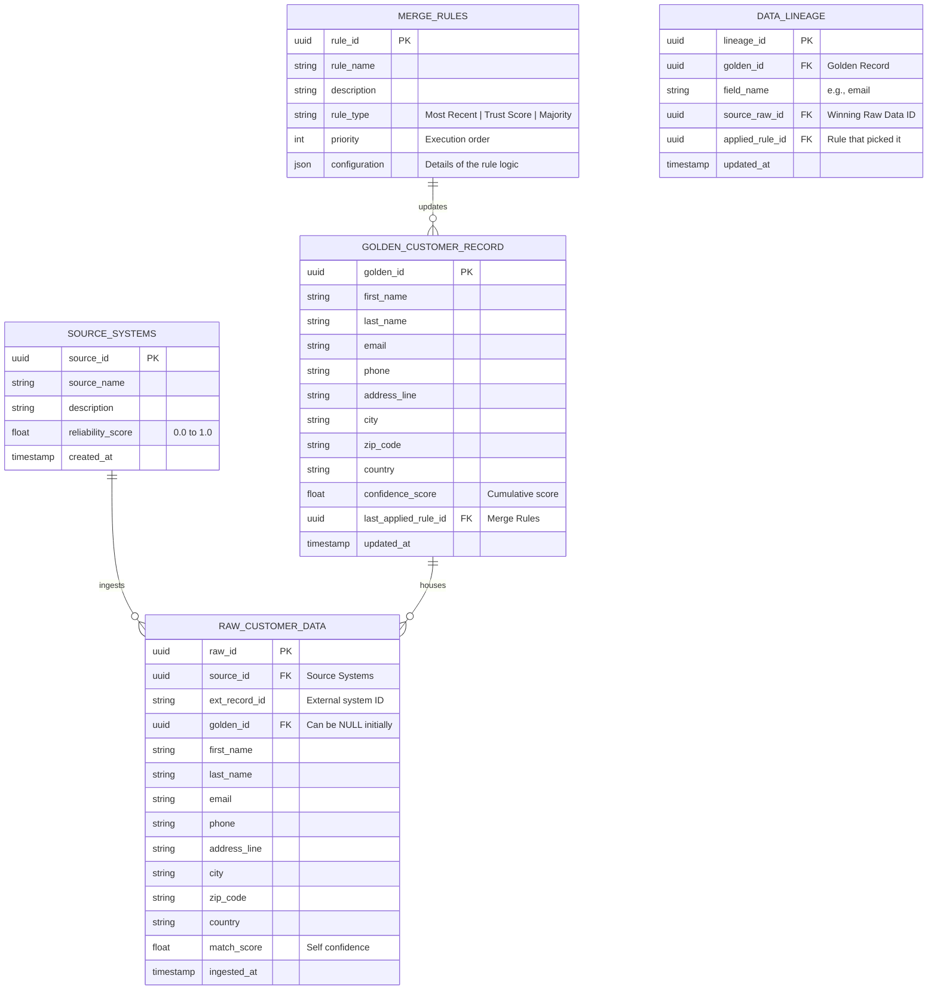

# Customer MDM Database Schema Design

This document outlines a basic **Master Data Management (MDM)** database schema design for a **Customer** entity. 

In MDM, the goal is to ingest data from multiple **Source Systems**, maintain the **Raw** data with its lineage, and apply **Merge Rules** (Survivorship) to generate a single, high-confidence **Golden Record** (Single View of Truth).

---

## 📊 Entity Relationship Diagram (ERD)

---

## 📋 Table Definitions

### 1. `SOURCE_SYSTEMS`
Defines the feeding sources (e.g., CRM, ERP, Shopify, Mobile App).

| Field | Type | Description |
| :--- | :--- | :--- |
| `source_id` | UUID | Primary Key. |
| `source_name` | VARCHAR(50) | e.g., 'Salesforce', 'SAP_ERP', 'Shopify'. |
| `description` | TEXT | Description of the system. |
| **`reliability_score`** | FLOAT | **Confidence weight (0-1)**. Salesforce might be `0.9` while a landing page form might be `0.4`. |
| `created_at` | TIMESTAMP | Audit timestamp. |

---

### 2. `RAW_CUSTOMER_DATA`
Storage for data exactly as it was ingested from the external source, before cleaning or merging.

| Field | Type | Description |
| :--- | :--- | :--- |
| `raw_id` | UUID | Primary Key. |
| `source_id` | UUID | **Foreign Key** to `SOURCE_SYSTEMS`. |
| `ext_record_id` | VARCHAR(255) | The ID of the record inside the external system. |
| **`golden_id`** | UUID | **Foreign Key** to `GOLDEN_RECORD`. Points to the merged record (NULL initially). |
| `first_name` | VARCHAR(100) | Raw first name. |
| `last_name` | VARCHAR(100) | Raw last name. |
| `email` | VARCHAR(255) | Raw email address. |
| `phone` | VARCHAR(50) | Raw phone number. |
| `address_line` | TEXT | Raw address. |
| `city` | VARCHAR(100) | Raw city. |
| `zip_code` | VARCHAR(20) | Raw zip. |
| `country` | VARCHAR(100) | Raw country. |
| **`match_score`** | FLOAT | **Match confidence**. Confidence that this record belongs to a specific cluster or golden record. |
| `ingested_at` | TIMESTAMP | When it entered the MDM. |

---

### 3. `GOLDEN_CUSTOMER_RECORD`
The master record. This is what down-stream applications consume.

| Field | Type | Description |
| :--- | :--- | :--- |
| `golden_id` | UUID | Primary Key. |
| `first_name` | VARCHAR(100) | Consolidated first name. |
| `last_name` | VARCHAR(100) | Consolidated last name. |
| `email` | VARCHAR(255) | Consolidated email address. |
| `phone` | VARCHAR(50) | Consolidated phone number. |
| `address_line` | TEXT | Consolidated address. |
| `city` | VARCHAR(100) | Consolidated city. |
| `zip_code` | VARCHAR(20) | Consolidated zip. |
| `country` | VARCHAR(100) | Consolidated country. |
| **`confidence_score`** | FLOAT | **Overall Confidence (0-1)** representing how "certain" the MDM is that this record is complete and accurate. |
| **`last_applied_rule_id`** | UUID | **Foreign Key** to `MERGE_RULES`. Shows which rule made the last update. |
| `updated_at` | TIMESTAMP | Last convergence timestamp. |

---

### 4. `MERGE_RULES` (Survivorship Rules)
Configurations describing how the Golden Record draws data from the Raw records.

| Field | Type | Description |
| :--- | :--- | :--- |
| `rule_id` | UUID | Primary Key. |
| `rule_name` | VARCHAR(100) | e.g., 'MOST_RECENT_WINS', 'TRUST_SYSTEM_WINS'. |
| **`rule_type`** | ENUM | Type: `RELEVANCE_SCORE`, `RECENCY`, `MAJORITY_VOTE`, `MIGRATE_NULLS`. |
| `priority` | INTEGER | Priority execution. Lower value = higher execution tier. |
| **`configuration`** | JSON | Holds logic configs (e.g., `{"field": "email", "weight_factor": 1.2, "fallback": "phone"}`). |

---

## ⚙️ How Match & Merge Logic Works

1.  **Ingestion**: `RAW_CUSTOMER_DATA` inserts data with its `source_id`.
2.  **Matching**: The MDM runs match algorithms (e.g., Levenshtein Distance, Jaro-Winkler) across Raw records making heavy use of `email` or `phone`. Records with high similarity group with a `match_score` inside the MDM.
3.  **Survivorship (Merging)**:
    *   **Tie-breaking via `reliability_score`**: If Source 'A' and Source 'B' both provide a `phone` number, the rule `TRUST_SYSTEM_WINS` examines the `SOURCE_SYSTEMS.reliability_score`. System with `0.9` wins over system with `0.5`.
    *   **Recency Wins**: The Raw record with the latest `ingested_at` overwrites fields on the Golden record.
4.  **Audit / Data Lineage**: The `DATA_LINEAGE` mapping logs exactly *which attribute came from which raw source*, securing complete traceability.
